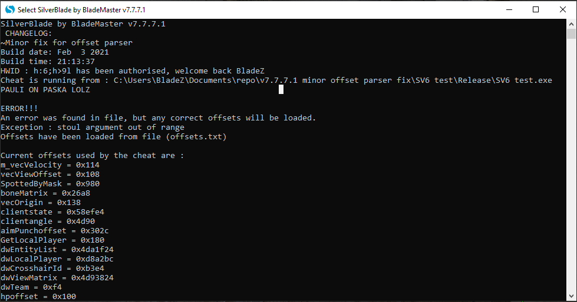
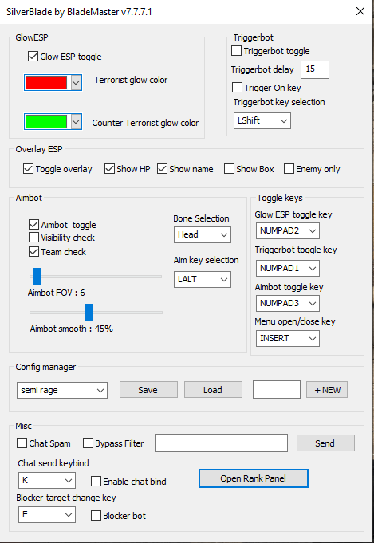
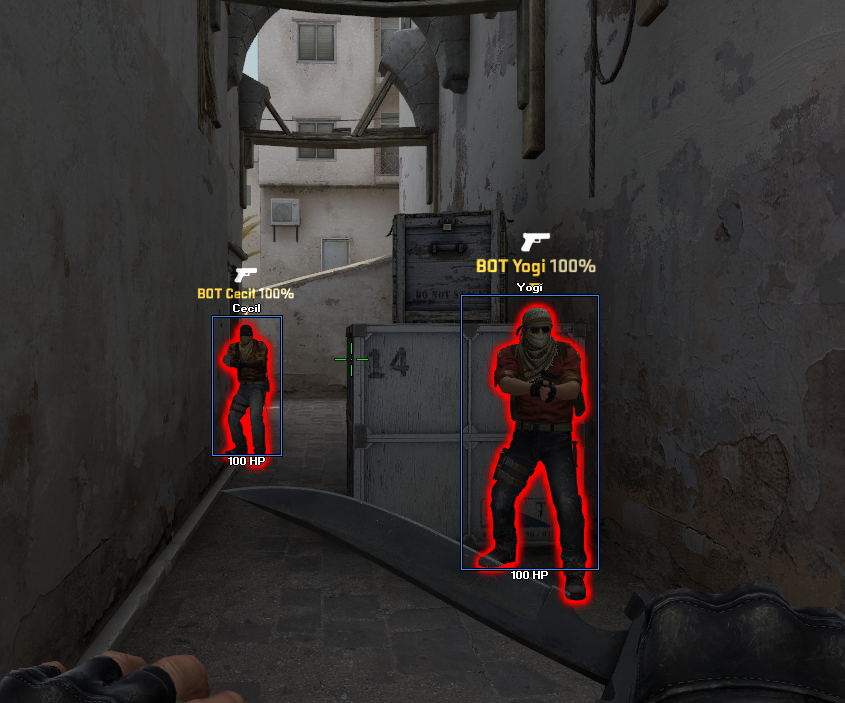
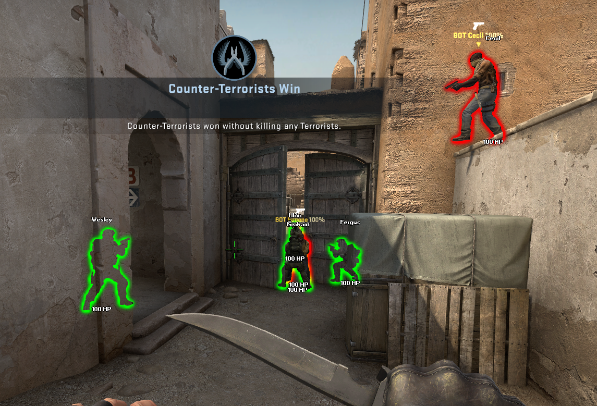

# Silverblade-CSGO
Silverblade is an external cheat for CS:GO (Counter strike global offensive) written in C++ using many WINAPI functions, and MFC (Microsoft foundation class).

# What this source includes
* All classic features found in external cheats (Wallhack, aimbot, triggerbot etc.)
* A DirectX overlay, for rendering visuals such as ESP boxes and player names
* Some unique features that you dont come by often in external cheats (Block bot, rank reveal, chat spam etc.)
* Horrible coding practices noone should ever follow (an excessive amount of global variables, and bs code in general)
* A cute MFC form based GUI
* CLI startup ui
* A basic HWID lock (will be released as a seperate project soon)

The cheat utilizes RPM (Read Process Memory) and WPM (Write Process Memory) WINAPI functions, to operate (just like 99% of external cheats for CSGO).

# IMPORTANT disclaimer
The code quality in this release is **sub-par**, i wrote it when i was 16 and it was my first ever "big" C++ application, most of it is pasted off of other open source cheats (which is why you might think each seperate feature is written by a diffrent person), it is not well optimised and barely works.

**Basically, this was my learning experience with game hacking and C++ in general.**

This source is meant for people to play around and experiment with, do not use it in matchmaking servers as it will probably get you **banned**.
If you get banned while using this, im not responsible for that, you used this knowing the risks.

# Screenshots
Opening CLI screen :



GUI:



Visuals in-game :





# Compiling the project
To compile this, you must have Visual studio 2017 or newer, DirectX SDK of june 2010 (for the overlay), MFC build tools and the latest Windows 10 SDK installed on your system.

**Important NOTE:** DirectX SDK is no longer available from the official microsoft website (some genius thought it was a great idea to remove it), however you can still find it [here](https://www.filehorse.com/download-directx-sdk/)

After you install all of the required tools, you must configure them accordingly :
* In visual studio, after you open the project you must right click on the project (SV6Test) then select properties->General->Windows SDK and then select the latest windows SDK available. Also make sure to select C++ 2017 standard.

* Then go to VC++ Directories, and set up the include and library paths for your DirectX SDK and Windows SDK. **Be sure to put the DirectX SDK path last, otherwise you will get errors.** After you are done, it should look something like this :


Lastly, select Release in build options, and x86 (32-bit) architecture, and build the project (Ctrl+Shift+B).
now you will get the cheat's binary (SV6Test.exe) in the release folder of the project.

# Config files and updating memory offsets and netvars easily
In silverblade, you can change config options and update memory offsets and netvars, without re-compiling the cheat.
To accomplish that, you have to create a folder in  your C: drive, C:\Configs\ . There you must place config files with .silverblade extension, and a file named offsets.txt, which will contain all up to date offsets for CSGO.

**NOTE**: you can find up to date offsets in hazedumper repo [here](https://github.com/frk1/hazedumper/blob/master/csgo.cs) .

Example of a config file (config.silverblade) :
```
glowespswitch=1
GlowTerroristRed=255.000000
GlowTerroristBlue=0.000000
GlowTerroristGreen=255.000000
GlowCounterTerroristRed=0.000000
GlowCounterTerroristBlue=255.000000
GlowCounterTerroristGreen=255.000000
triggerbotswitch=0
triggerbotmode=0
triggerbotdelay=15
triggerbotkey=160
overlayespswitch=1
overlayespnames=1
overlayesphp=1
overlayespbox=0
overlayespenenemyonly=0
aimbotswitch=1
aimbotbone=8
aimbotfov=6
aimbotpsmooth=45
aimbotkey=18
aimbotvischeck=0
aimbotteamcheck=1
```

Example of an offset file (offsets.txt) :
```
        public const Int32 cs_gamerules_data = 0x0;
        public const Int32 m_ArmorValue = 0xB378;
        public const Int32 m_Collision = 0x320;
        public const Int32 m_CollisionGroup = 0x474;
        public const Int32 m_Local = 0x2FBC;
        public const Int32 m_MoveType = 0x25C;
        public const Int32 m_OriginalOwnerXuidHigh = 0x31C4;
        public const Int32 m_OriginalOwnerXuidLow = 0x31C0;
        public const Int32 m_SurvivalGameRuleDecisionTypes = 0x1328;
        public const Int32 m_SurvivalRules = 0xD00;
        public const Int32 m_aimPunchAngle = 0x302C;
        public const Int32 m_aimPunchAngleVel = 0x3038;
        public const Int32 m_angEyeAnglesX = 0xB37C;
        public const Int32 m_angEyeAnglesY = 0xB380;
        public const Int32 m_bBombPlanted = 0x9A5;
        public const Int32 m_bFreezePeriod = 0x20;
        public const Int32 m_bGunGameImmunity = 0x3944;
        public const Int32 m_bHasDefuser = 0xB388;
        public const Int32 m_bHasHelmet = 0xB36C;
        public const Int32 m_bInReload = 0x32A5;
        public const Int32 m_bIsDefusing = 0x3930;
        public const Int32 m_bIsQueuedMatchmaking = 0x74;
        public const Int32 m_bIsScoped = 0x3928;
        public const Int32 m_bIsValveDS = 0x7C;
        public const Int32 m_bSpotted = 0x93D;
        public const Int32 m_bSpottedByMask = 0x980;
        public const Int32 m_bStartedArming = 0x33F0;
        public const Int32 m_bUseCustomAutoExposureMax = 0x9D9;
        public const Int32 m_bUseCustomAutoExposureMin = 0x9D8;
        public const Int32 m_bUseCustomBloomScale = 0x9DA;
        public const Int32 m_clrRender = 0x70;
        public const Int32 m_dwBoneMatrix = 0x26A8;
        public const Int32 m_fAccuracyPenalty = 0x3330;
        public const Int32 m_fFlags = 0x104;
        public const Int32 m_flC4Blow = 0x2990;
        public const Int32 m_flCustomAutoExposureMax = 0x9E0;
        public const Int32 m_flCustomAutoExposureMin = 0x9DC;
        public const Int32 m_flCustomBloomScale = 0x9E4;
        public const Int32 m_flDefuseCountDown = 0x29AC;
        public const Int32 m_flDefuseLength = 0x29A8;
        public const Int32 m_flFallbackWear = 0x31D0;
        public const Int32 m_flFlashDuration = 0xA420;
        public const Int32 m_flFlashMaxAlpha = 0xA41C;
        public const Int32 m_flLastBoneSetupTime = 0x2924;
        public const Int32 m_flLowerBodyYawTarget = 0x3A90;
        public const Int32 m_flNextAttack = 0x2D70;
        public const Int32 m_flNextPrimaryAttack = 0x3238;
        public const Int32 m_flSimulationTime = 0x268;
        public const Int32 m_flTimerLength = 0x2994;
        public const Int32 m_hActiveWeapon = 0x2EF8;
        public const Int32 m_hMyWeapons = 0x2DF8;
        public const Int32 m_hObserverTarget = 0x338C;
        public const Int32 m_hOwner = 0x29CC;
        public const Int32 m_hOwnerEntity = 0x14C;
        public const Int32 m_iAccountID = 0x2FC8;
        public const Int32 m_iClip1 = 0x3264;
        public const Int32 m_iCompetitiveRanking = 0x1A84;
        public const Int32 m_iCompetitiveWins = 0x1B88;
        public const Int32 m_iCrosshairId = 0xB3E4;
        public const Int32 m_iDefaultFOV = 0x332C;
        public const Int32 m_iEntityQuality = 0x2FAC;
        public const Int32 m_iFOVStart = 0x31E8;
        public const Int32 m_iGlowIndex = 0xA438;
        public const Int32 m_iHealth = 0x100;
        public const Int32 m_iItemDefinitionIndex = 0x2FAA;
        public const Int32 m_iItemIDHigh = 0x2FC0;
        public const Int32 m_iMostRecentModelBoneCounter = 0x2690;
        public const Int32 m_iObserverMode = 0x3378;
        public const Int32 m_iShotsFired = 0xA390;
        public const Int32 m_iState = 0x3258;
        public const Int32 m_iTeamNum = 0xF4;
        public const Int32 m_lifeState = 0x25F;
        public const Int32 m_nFallbackPaintKit = 0x31C8;
        public const Int32 m_nFallbackSeed = 0x31CC;
        public const Int32 m_nFallbackStatTrak = 0x31D4;
        public const Int32 m_nForceBone = 0x268C;
        public const Int32 m_nTickBase = 0x3430;
        public const Int32 m_rgflCoordinateFrame = 0x444;
        public const Int32 m_szCustomName = 0x303C;
        public const Int32 m_szLastPlaceName = 0x35B4;
        public const Int32 m_thirdPersonViewAngles = 0x31D8;
        public const Int32 m_vecOrigin = 0x138;
        public const Int32 m_vecVelocity = 0x114;
        public const Int32 m_vecViewOffset = 0x108;
        public const Int32 m_viewPunchAngle = 0x3020;
        public const Int32 anim_overlays = 0x2980;
        public const Int32 clientstate_choked_commands = 0x4D30;
        public const Int32 clientstate_delta_ticks = 0x174;
        public const Int32 clientstate_last_outgoing_command = 0x4D2C;
        public const Int32 clientstate_net_channel = 0x9C;
        public const Int32 convar_name_hash_table = 0x2F0F8;
        public const Int32 dwClientState = 0x58EFE4;
        public const Int32 dwClientState_GetLocalPlayer = 0x180;
        public const Int32 dwClientState_IsHLTV = 0x4D48;
        public const Int32 dwClientState_Map = 0x28C;
        public const Int32 dwClientState_MapDirectory = 0x188;
        public const Int32 dwClientState_MaxPlayer = 0x388;
        public const Int32 dwClientState_PlayerInfo = 0x52C0;
        public const Int32 dwClientState_State = 0x108;
        public const Int32 dwClientState_ViewAngles = 0x4D90;
        public const Int32 dwEntityList = 0x4DA1F24;
        public const Int32 dwForceAttack = 0x31D3460;
        public const Int32 dwForceAttack2 = 0x31D346C;
        public const Int32 dwForceBackward = 0x31D349C;
        public const Int32 dwForceForward = 0x31D3478;
        public const Int32 dwForceJump = 0x524BE84;
        public const Int32 dwForceLeft = 0x31D3490;
        public const Int32 dwForceRight = 0x31D34B4;
        public const Int32 dwGameDir = 0x62D7F8;
        public const Int32 dwGameRulesProxy = 0x52BF16C;
        public const Int32 dwGetAllClasses = 0xDB1F8C;
        public const Int32 dwGlobalVars = 0x58ECE8;
        public const Int32 dwGlowObjectManager = 0x52EA520;
        public const Int32 dwInput = 0x51F3508;
        public const Int32 dwInterfaceLinkList = 0x945544;
        public const Int32 dwLocalPlayer = 0xD8A2BC;
        public const Int32 dwMouseEnable = 0xD8FE60;
        public const Int32 dwMouseEnablePtr = 0xD8FE30;
        public const Int32 dwPlayerResource = 0x31D17E0;
        public const Int32 dwRadarBase = 0x51D6C9C;
        public const Int32 dwSensitivity = 0xD8FCFC;
        public const Int32 dwSensitivityPtr = 0xD8FCD0;
        public const Int32 dwSetClanTag = 0x8A1A0;
        public const Int32 dwViewMatrix = 0x4D93824;
        public const Int32 dwWeaponTable = 0x51F3FC8;
        public const Int32 dwWeaponTableIndex = 0x325C;
        public const Int32 dwYawPtr = 0xD8FAC0;
        public const Int32 dwZoomSensitivityRatioPtr = 0xD94D60;
        public const Int32 dwbSendPackets = 0xD73EA;
        public const Int32 dwppDirect3DDevice9 = 0xA7050;
        public const Int32 find_hud_element = 0x2804E320;
        public const Int32 force_update_spectator_glow = 0x3AD962;
        public const Int32 interface_engine_cvar = 0x3E9EC;
        public const Int32 is_c4_owner = 0x3BA430;
        public const Int32 m_bDormant = 0xED;
        public const Int32 m_flSpawnTime = 0xA370;
        public const Int32 m_pStudioHdr = 0x294C;
        public const Int32 m_pitchClassPtr = 0x51D6F38;
        public const Int32 m_yawClassPtr = 0xD8FAC0;
        public const Int32 model_ambient_min = 0x59205C;
        public const Int32 set_abs_angles = 0x1DF9C0;
        public const Int32 set_abs_origin = 0x1DF800;
```
# HWID lock
To open the cheat after compiling, you need to either change the HWID to the one of the computer you will be using (using a seperate project ill be releasing soon) or comment/delete the HWID lock code.


