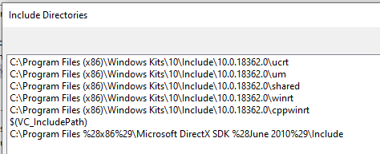

# Silverblade-CSGO
Silverblade is an external cheat for CS:GO (Counter strike global offensive) written in C++ using many WINAPI functions, and MFC (Microsoft foundation class).

# What this source includes
* All classic features found in external cheats (Wallhack, aimbot, triggerbot etc.)
* A DirectX overlay, for rendering visuals such as ESP boxes and player names
* Some unique features that you dont come by often in external cheats (Block bot, rank reveal, chat spam etc.)
* Horrible coding practices noone should ever follow (an excessive amount of global variables, and bs code in general)
* A cute MFC form based GUI
* CLI startup ui

The cheat utilizes RPM (Read Process Memory) and WPM (Write Process Memory) WINAPI functions, to operate (just like 99% of external cheats for CSGO).

# IMPORTANT disclaimer
The code quality in this release is **sub-par**, i wrote it when i was 16 and it was my first ever "big" C++ application, most of it is pasted off of other open source cheats (which is why you might think each seperate feature is written by a diffrent person), it is not well optimised and barely works.

**Basically, this was my learning experience with game hacking and C++ in general.**

This source is meant for people to play around and experiment with, do not use it in matchmaking servers as it will probably get you **banned**.
If you get banned while using this, im not responsible for that, you used this knowing the risks.

# Compiling the project
To compile this, you must have Visual studio 2017 or newer, DirectX SDK of june 2010 (for the overlay) and the latest Windows 10 SDK installed on your system.

After you install all of the required tools, you must configure them accordingly :
* In visual studio, after you open the project you must right click on the project (SV6Test) then select properties->General->Windows SDK and then select the latest windows SDK available. Also make sure to select C++ 2017 standard.

* Then go to VC++ Directories, and set up the include and library paths for your DirectX SDK. **Be sure to put the DirectX SDK path last, otherwise you will get errors.** After you are done, it should look something like this :

